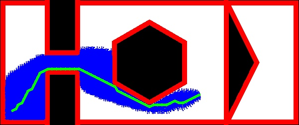
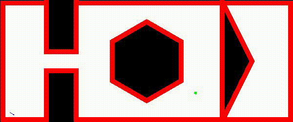

# A-star_implementation

Github : https://github.com/sj0897/A-star_Implementation

## Final Output


## Animation
 

##
Necessary libraries : numpy, openCV

Note : Please ensure ffmpeg is also installed to be able to genearte an accessiable animation file
## Run
```
python3 a_star_sparsh.py
```
Then follow on screen instructions to run the program and generate an animation video (.avi)

## Video
https://www.youtube.com/watch?v=0UaQYR_p5Gk


